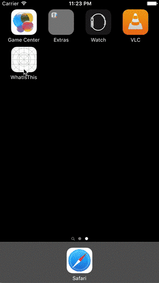

# WhatsThis-iOS

This is the iOS version of [WhatsThis](https://github.com/Leliana/WhatsThis)

It is an example to show how to use the single file version of [mxnet](https://github.com/dmlc/mxnet) to get Deep Learning on mobile device.

Leliana's WhatsThis is for Andriod and this one is for iOS.

It is a quick implementation and mostly self explained. 
I didn't compile mxnet as a framework in this project. I simply add a source file and a header file of mxnet and compile it with the other code.

If you are interested in compiling mxnet as a framework/library for iOS, you can find a blog post (in Chinese) [here](http://www.liuxiao.org/2015/12/ios-mxnet-的-ios-版本编译/).

This repository is large (~50 MB) because I put in a pre-trained model file for convenience. It is the Inception-1K model from the [model gallery of mxnet](http://mxnet.readthedocs.org/en/latest/pretrained.html). You should be able to replace it with any other pre-trained models. 

About the performance, it takes about 4 seconds (estimated) on iPhone 6 to process an image.

Please direct any advanced question to the [mxnet](https://github.com/dmlc/mxnet) developers.

